<p align="center">
  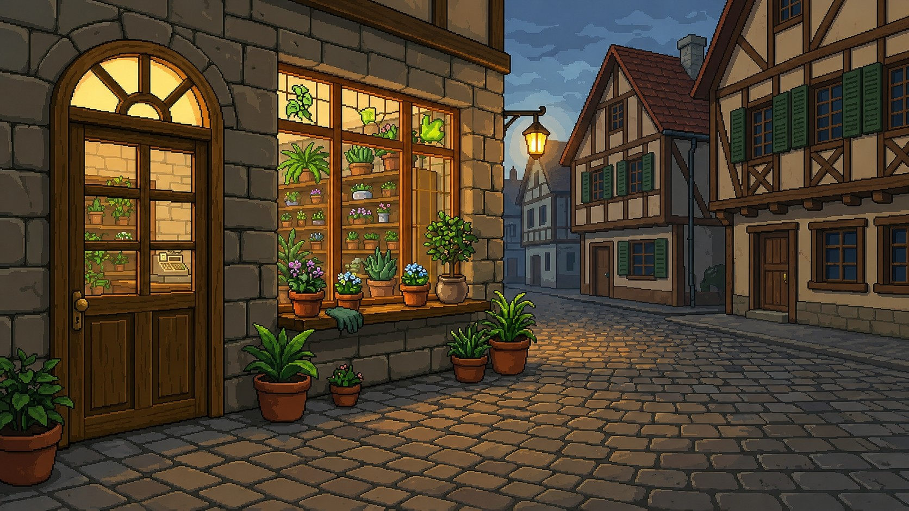
</p>

<h1 align="center">🌱 Potted</h1>

<p align="center">
  <em>A cozy pixel-art plant nursery game built with React Native & Expo</em>
</p>

<p align="center">
  
  
  
</p>

---

## 🌸 What is Potted?

**Potted** is a relaxing plant nursery game where you buy seeds, plant them in pots, water them, and watch them bloom through beautiful growth stages. Decorate your rooms with paintings and pets, manage your inventory, and earn coins by harvesting flowers.

<p align="center">
  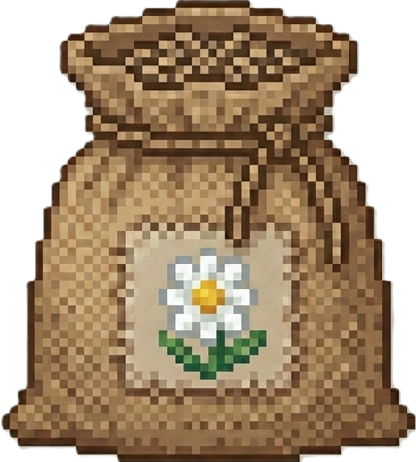
  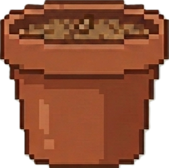
  
  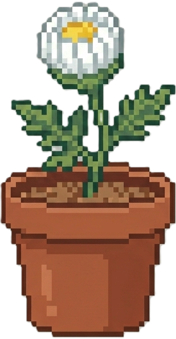
  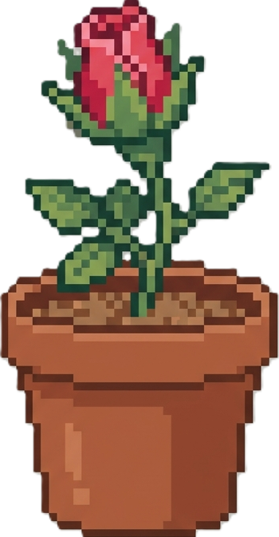
  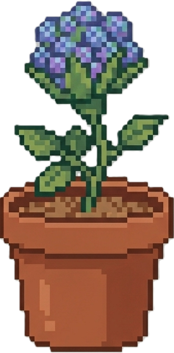
</p>

<p align="center"><em>Seed → Plant → Water → Bloom 🌷</em></p>

---

## 🎮 Features

### 🏡 Three Unique Rooms
| Room | Description |
|------|-------------|
| **Room 1 — Window Shelf** | Two wooden shelves by the window. Drag pots from the sill, plant seeds, and water them. |
| **Room 2 — Balcony** | Hanging pots on curtain rods. Drag pots from the stool and hang your plants. |
| **Room 3 — Sunroom** | A bright sunroom with shelf pots and hanging hooks. |

### 🌻 7 Potted Flowers

Each flower grows through 4 stages: **Seed → Bud → Slight Bloom → Full Bloom**

<p align="center">
  
  
  
  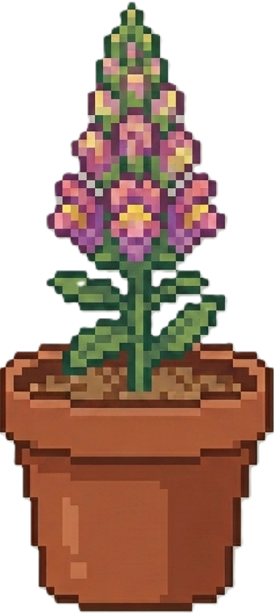
  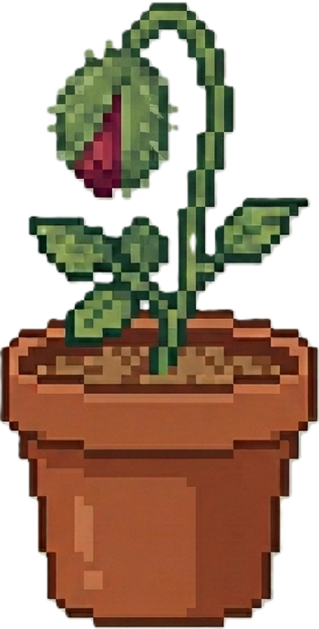
  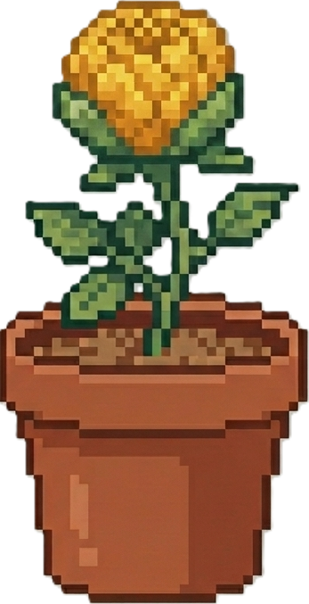
  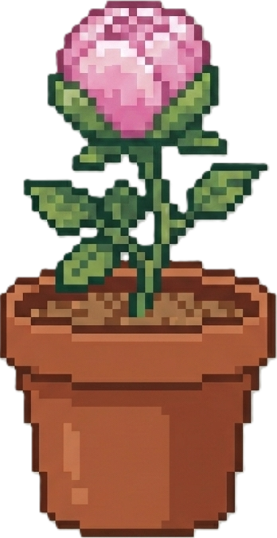
</p>
<p align="center">
  <em>Daisy · Rose · Hydrangea · Snapdragon · Poppy · Marigold · Peony</em>
</p>

### 🪴 5 Hanging Plants

<p align="center">
  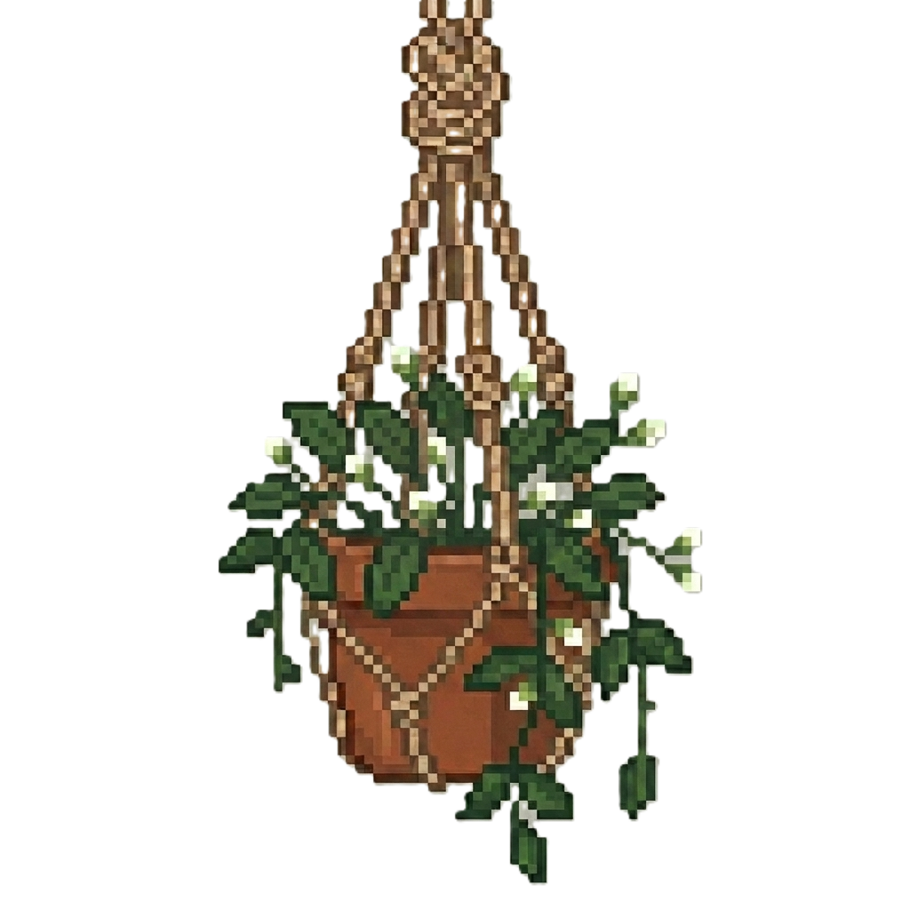
  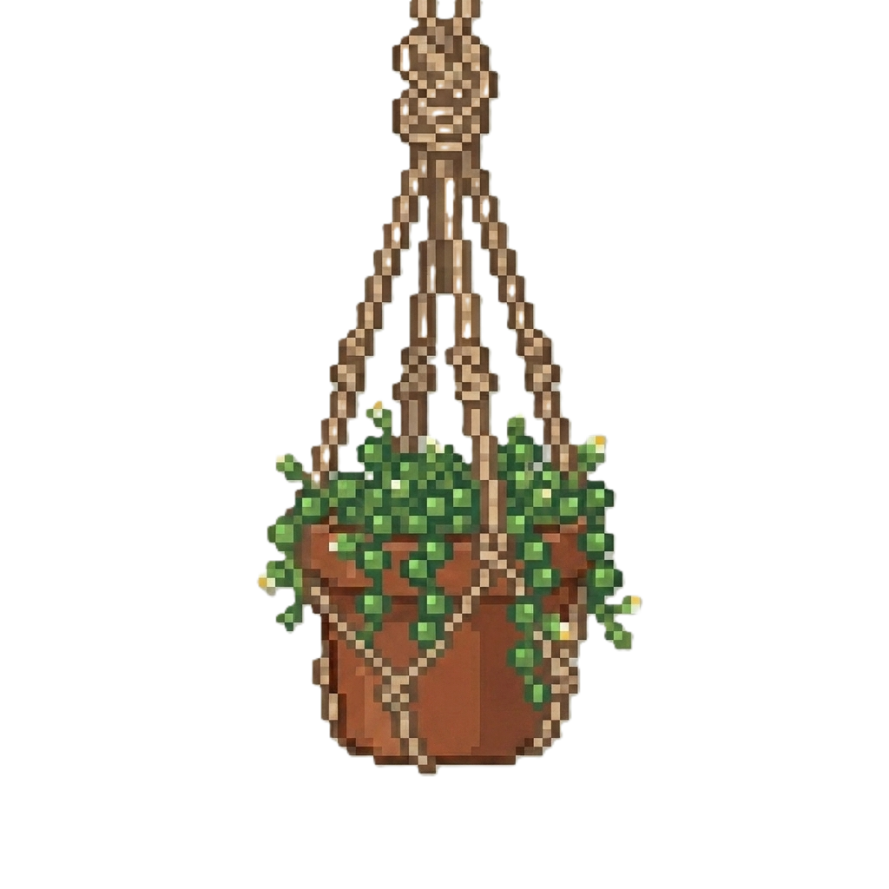
</p>
<p align="center">
  <em>Jasmine · String of Pearls · Philodendron · Petunia · Bougainvillea</em>
</p>

### 🐾 Adorable Pets

<p align="center">
  
  
</p>

### 🛒 Nursery Shop
Visit the nursery to buy seed bags with your earned coins. Seeds go into your inventory — drag them onto empty pots to plant!

<p align="center">
  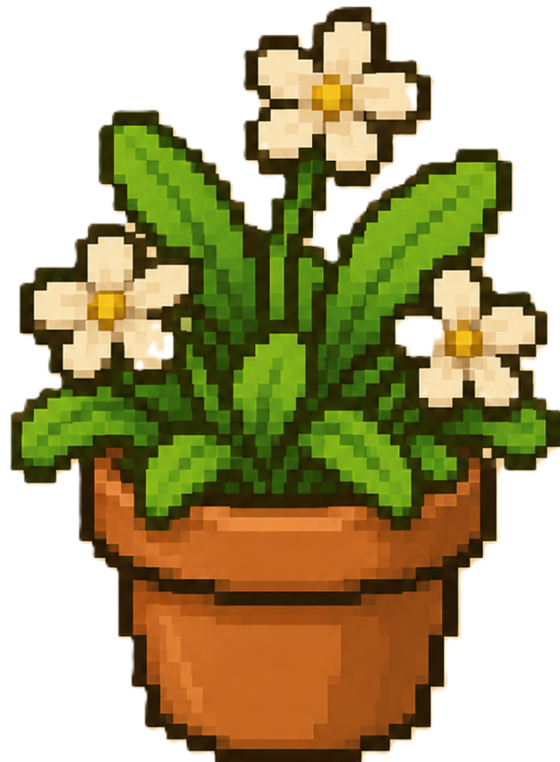
  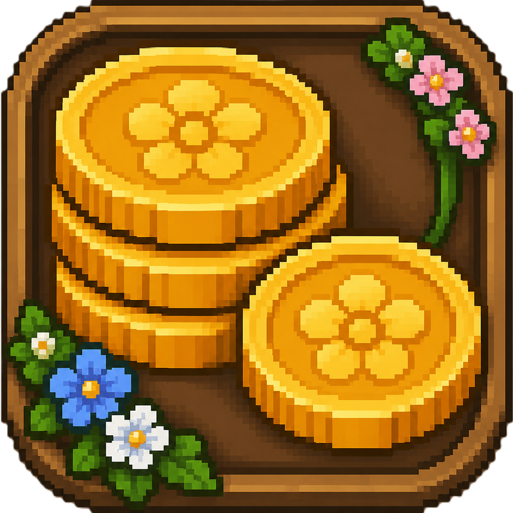
  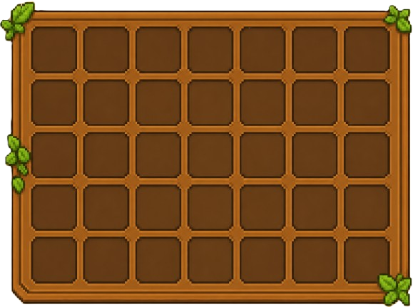
</p>

### 💧 Watering Mechanic
Drag the watering can over a planted pot and **hold for 2 seconds** to water it. Watering a seed instantly advances it to the bud stage!

### ✨ More Features
- 🎵 **Background Music** — Looping ambient music with mute toggle
- 🌤️ **Seasonal Backgrounds** — Room backgrounds change with spring, summer, autumn, and winter
- 🖼️ **Wall Decor** — Hang paintings on your walls (6 paintings available)
- 🏆 **Achievements** — Unlock achievements like "First Bloom" and "Green Thumb"
- 💾 **Auto-Save** — Progress is saved with AsyncStorage

---

## 🛠️ Tech Stack

| Technology | Purpose |
|------------|---------|
| **React Native** 0.74 | Cross-platform mobile framework |
| **Expo** 51 | Development toolchain & build system |
| **React Navigation** | Screen routing & transitions |
| **Reanimated** 3 | Smooth drag-and-drop animations |
| **Gesture Handler** | Touch gestures for dragging pots, seeds, and watering can |
| **AsyncStorage** | Persistent game state storage |
| **Expo AV** | Background music playback |

---

## 🚀 Getting Started

### Prerequisites
- Node.js 18+
- npm or yarn
- Expo CLI (`npx expo`)
- Expo Go app (for mobile testing)

### Installation

```bash
# Clone the repo
git clone https://github.com/Ishani018/Potted.git
cd Potted

# Install dependencies
npm install

# Start the dev server
npx expo start
```

> **Note:** Asset files (images, sounds) are not included in the repository due to their size. Contact the repo owner for the asset bundle.

---

## 📁 Project Structure

```
potted/
├── App.js                    # Entry point & navigation setup
├── src/
│   ├── components/           # Reusable UI components
│   │   ├── CartOverlay.js    # Seed cart from nursery
│   │   ├── InventoryOverlay.js # Inventory grid overlay
│   │   ├── PlantPopup.js     # Plant info / harvest / remove popup
│   │   ├── PlantSlot.js      # Individual plant rendering
│   │   └── WateringCan.js    # Draggable watering can
│   ├── constants/
│   │   ├── gameData.js       # Flowers, timers, achievements, prices
│   │   └── nurseryData.js    # Nursery shop layout constants
│   ├── context/
│   │   ├── GameContext.js     # Game state reducer (buy, plant, water, harvest)
│   │   └── LayoutContext.js   # Screen dimensions provider
│   ├── engine/
│   │   ├── assets.js          # All asset require() mappings
│   │   ├── gameEngine.js      # Growth tick logic & watering
│   │   ├── project.js         # Coordinate projection (base → screen)
│   │   └── snapPoints.js      # Pot/hook positions per room
│   └── screens/
│       ├── MainScreen.js      # Title screen with play button
│       ├── GardenScreen.js    # Main game screen (all rooms)
│       ├── NurseryScreen.js   # Seed shop
│       └── CartTransitionScreen.js # Cart animation between screens
├── readme_assets/             # Images used in this README
└── package.json
```

---

## 🎯 Game Loop

```
Buy Seeds (Nursery) → Store in Inventory → Drag Pot to Shelf
         ↓
  Plant Seed in Pot → Water with Can (hold 2s) → Watch it Grow
         ↓
   Harvest at Full Bloom → Earn Coins 💰 → Buy More Seeds!
```

---

## 📄 License

This project is private. All pixel art assets are original creations.

---

<p align="center">
  Made with 🌿 and lots of pixel love
</p>
